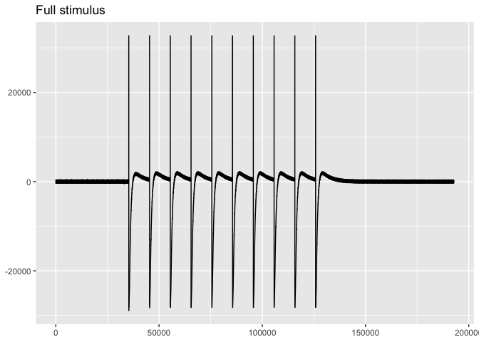
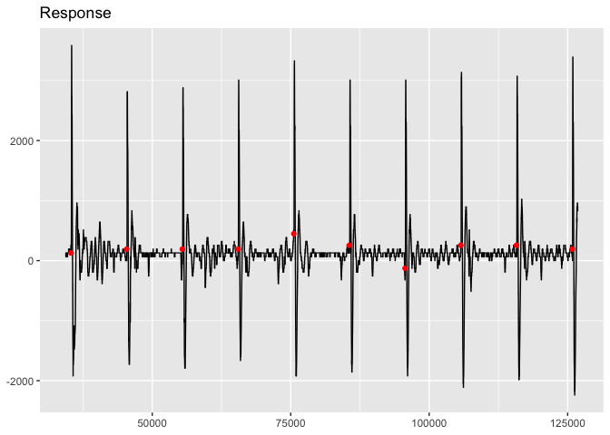

<!-- README.md is generated from README.Rmd. Please edit that file -->

# amganalysis

<!-- badges: start -->

<!-- badges: end -->

The goal of `amganalysis` is to provide a simplified pathway for loading
AMG data, checking for any issues, finding peaks of the response,
analyzing the data, and visualizing it.

## Example analysis

This document shows the basic capabilities of the `amganalysis` package
and how an analysis of a trace might be performed.

``` r
library(amganalysis)
```

### The data

The data is expected to be imported as a wave file using
`tuneR::readWave("path/file.wav", toWaveMC = TRUE)`. Make sure to set
`toWaveMC = TRUE`, which imports multiple tracks, since `amganalysis`
functions expect readings for the amplitude of both the stimulus and the
response. `amganalysis` provides an example wave file imported in this
fashion: `ex_waveMC`. Let’s load it.

``` r
wav <- ex_waveMC
```

To work with the data we need to get it into the form of a data frame
with `waveMC_to_tbl()`. This will make it much easier to use the normal
data analysis pipeline of R and the
[tidyverse](https://www.tidyverse.org) on the AMG data.
`waveMC_to_tbl()` also creates a data frame, or
[tibble](https://tibble.tidyverse.org/), that conforms to the structure
expected by the functions in `amganalysis`. We can refer to this as a
trace tibble. `waveMC_to_tbl()` creates a tibble with four columns:
sample, secs, stimulus, and response. The function automatically
distinguishes the stimulus recording channel from the response recording
channel. The frequency (`freq` argument) of the recording is used to
convert samples into seconds (secs). The secs variable is there for
convenience. It makes it easier to see how long the recording is, where
events are in the recording, or how far apart they are.

Let’s make a trace tibble with `waveMC_to_tbl()`. This is equivalent to
the example data `ex_trace_tbl` which comes with `amganalysis`.

``` r
trace_tbl <- waveMC_to_tbl(wav, freq = 10000)
#> Loading required package: tuneR

trace_tbl
#> # A tibble: 192,804 x 4
#>    sample     secs stimulus response
#>     <int>    <dbl>    <int>    <int>
#>  1      1 0.0001       -256      128
#>  2      2 0.0002       -256      128
#>  3      3 0.000300     -320      128
#>  4      4 0.0004       -384      128
#>  5      5 0.0005       -320      128
#>  6      6 0.000600     -320      128
#>  7      7 0.0007       -256      128
#>  8      8 0.0008       -192      128
#>  9      9 0.0009       -192      128
#> 10     10 0.001         -64      128
#> # … with 192,794 more rows
```

Most functions from `amganalysis` expect a trace tibble as an input. A
**trace tibble** is a data frame or tibble with numeric columns named
“sample”, “stimulus”, and “response” plus any other metadata columns
such as secs. If any of these three columns are not present or if they
have different names, the functions in `amganalysis` will not work.

### Examing the data

The easiest way to inspect the data is to start by visualizing it. We
can separately visualize the recording of the response and stimulus to
make sure there are no oddities. Setting `filter_response = FALSE`
visualizes the entire recording.

``` r
viz_response(trace_tbl, filter_response = FALSE, title = "Full response")
```


``` r

viz_stimulus(trace_tbl, filter_stimulus = FALSE, title = "Full stimulus")
```



Both of the plots look good. They both have ten clearly distinguished
peaks. The response plot shows the points in red where the stimuli were
performed and these seem to correspond to the peaks. We can get a closer
look at the shape of the response by using the same function but setting
`filter_response` to `TRUE`, which is the default. This filters out the
response before the first stimulus and after the last stimulus.

``` r
viz_response(trace_tbl, title = "Response")
```



Note that you can change the aesthetic features of the plot by adding
`ggplot2` commands. For instance, we can focus more on the response by
getting rid of extra elements through `theme_void()`. I also add a bit
more data before to each side of the plot with `buffer`. Make sure to
load `ggplot2`.

``` r
library(ggplot2)
viz_response(trace_tbl,
             title = "Response",
             show_stimulus = FALSE,
             buffer = 250) + 
  theme_void()
```


Another very useful way to explore the data through visualization is
with `viz_response_interactive()`, which creates an interactive plot of
the response data, enabling the user to zoom in on the data.

### Finding the stimuli and peaks

The next step is to find when the stimuli performed and calculate the
starting and ending point for the corresponding response peaks. Finding
the stimuli is relatively simple because when the stimuli is performed
the amplitude of the stimulus rises immediately from its baseline. This
is how `find_stimuli()` works, using the `stimulus_diff` argument to
provide a minimum amplitude difference between samples.

``` r
find_stimuli(trace_tbl)
#> # A tibble: 10 x 8
#>    sample  secs stimulus response amp_diff sample_diff sec_diff    hz
#>     <int> <dbl>    <int>    <int>    <int>       <int>    <dbl> <dbl>
#>  1  35331  3.53    32576      128    32576          NA    NA       NA
#>  2  45385  4.54    32640      192    32256       10054     1.01     1
#>  3  55439  5.54    32640      192    32192       10054     1.01     1
#>  4  65492  6.55    27584      192    27136       10053     1.01     1
#>  5  75545  7.55    32320      448    31872       10053     1.01     1
#>  6  85598  8.56    32640      256    32256       10053     1.01     1
#>  7  95653  9.57    32640     -128    32192       10055     1.01     1
#>  8 105709 10.6     32640      256    32128       10056     1.01     1
#>  9 115765 11.6     32640      256    32512       10056     1.01     1
#> 10 125821 12.6     27712      192    27136       10056     1.01     1
```

In addition to finding the number of stimuli and the samples where they
were performed, `find_stimuli(trace_tbl)` shows the time gap between
stimuli and the calculated hertz. In this case, we can see that the
stimuli were performed once per second, or 1hz.

Finding the peaks of the response is a bit more difficult and not nearly
as clear cut. Looking at the response column in the output from
`find_stimuli(trace_tbl)`, you can see that the response amplitude
differs between -128 and 448. There is no completely consistent
baseline. It can, therefore, be difficult to determine when the
amplitude of the response begins to rise as a result of the stimulus.
`amganalysis` provides three functions to help find peaks:
`find_peaks_response()`, `find_peaks_stimulus()`, and
`find_peaks_manual()`. These functions should most likely be used in
this order.

`find_peaks_response()` is the most robust method and works well when
the peaks are relatively uniform. It works by finding response
amplitudes above a specified `min_amp` and then extends the region down
to all samples above the given `baseline`. The defaults all work pretty
well with the `trace_tbl` data, but they may have to be altered for
different data. In particular, the `baseline` argument can be
manipulated to have unique baselines for each peak if the data is a bit
messier.

It should also be noted that instead of returning a tibble, the
`find_peaks_()` functions return a list of numeric vectors of the
samples where the peaks occur. This data type is used throughout the
`amganalysis` package wherever there is a `peaks` argument.

``` r
peaks <- find_peaks_response(trace_tbl)
```

`find_peaks_stimulus()` is a simpler function. It finds the onset of the
stimuli in a fashion similar to `find_stimuli()` and starts the peak a
set number of milliseconds after each stimulus as defined by the `delay`
argument. The `baseline` argument can either be defined by the user or
decided separately for each peak based on the value of the response
after the given delay. This latter method is the default.

Finally, `find_peaks_manual()` is a helper function to manually input
the start and end of peaks. This is useful for particularly odd peaks.
The starting and ending points can be determined through visualizing the
peaks. `viz_response_interactive()` is particularly useful here.

Because `find_peaks_response()` works well here, we will use that to
define `peaks`.

### Checking the peaks

The `find_peaks_()` functions will define the beginning and end of
peaks, but that does not mean that they will correctly find them. You
can perform a number of checks to ensure that the peaks were correctly
identified. The simplest check is to ensure that the number of peaks
identified is the same as the number of stimuli identified. We can then
move to see what the delay is between the onset of the stimuli and the
beginning of the peaks.

``` r
length(peaks) == nrow(find_stimuli(trace_tbl))
#> [1] TRUE
peaks_delay(trace_tbl, peaks)
#>  [1] 5.9 6.6 6.5 6.5 3.1 5.8 6.5 5.9 6.3 6.7
```

`peaks_delay()` shows that the fifth peak is a bit of an outlier with a
delay of only 3.1 milliseconds. This is somewhat unsurprising as the
fifth stimulus occurred when the response amplitude was at 448.

We can also make some other checks on the peaks data to see what we are
dealing with. Here, we are looking for consistency. However, it is
important to note that the amplitude values are discontinuous.

``` r
peaks_min_amp(trace_tbl, peaks)
#>  [1] 320 320 320 320 320 320 320 320 320 320
peaks_max_amp(trace_tbl, peaks)
#>  [1] 3584 2816 2880 3008 3328 3008 3008 3136 3072 3392
peaks_first_amp(trace_tbl, peaks)
#>  [1] 320 320 320 320 384 320 320 320 320 320
peaks_last_amp(trace_tbl, peaks)
#>  [1] 320 448 448 448 320 320 384 320 448 320
```

Looking at the results for `peaks_last_amp(trace_tbl, peaks)`, we can
see that the amplitudes often do not get down to the baseline. We can
fix this by augmenting the `lengthen` argument in
`find_peaks_response()`.

``` r
peaks2 <- find_peaks_response(trace_tbl, lengthen = 200)
```

Rechecking the peaks with `peaks2`, we can see that the end of the peaks
is now correct. However, the fifth peak now starts before the stimulus,
which is clearly wrong.

``` r
peaks_last_amp(trace_tbl, peaks2)
#>  [1] 320 320 320 320 320 320 320 320 320 320
peaks_delay(trace_tbl, peaks2)
#> Warning: Peak(s) 5 begin less than 0 milliseconds after the stimulus.
#>  [1]  5.9  6.6  6.5  6.5 -1.9  5.8  6.5  5.9  6.3  6.7
```

### Visual checks on the peaks

The other primary manner of checking the peaks is to do so visually. The
easiest first step to double check that the peaks broadly correspond to
the stimuli is with `viz_highlight_peaks()`.

``` r
viz_highlight_peaks(trace_tbl, peaks2, title = "Highlight peaks")
```


To get into a more in depth visual analysis of the peaks, we can use
`viz_peak()` to visualize individual peaks and provide information about
them. Let’s look at the fifth peak.

``` r
viz_peak(trace_tbl, peaks2, peak_nr = 5)
#> Warning: Peak begins less than 0 milliseconds after the stimulus.
```


You could also get an even closer view with
`viz_response_interactive(trace_tbl, peaks)` and zooming in on the fifth
peak. Using this method, it is possible to see that the baseline of the
fifth peak is 448. At this point, you could manually create a peak with
`find_peaks_manual()` and inputting the samples where the amplitude goes
above 448 and then back below 448. Or you can create separate baselines
in `find_peaks_response()`, which we will do here.

``` r
peaks3 <- find_peaks_response(trace_tbl, lengthen = 200,
                              baseline = c(rep(256, 4), 448, rep(256, 5)))
```

We can then check this change.

``` r
peaks_first_amp(trace_tbl, peaks3)
#>  [1] 320 320 320 320 512 320 320 320 320 320
peaks_last_amp(trace_tbl, peaks3)
#>  [1] 320 320 320 320 512 320 320 320 320 320
peaks_delay(trace_tbl, peaks3)
#>  [1] 5.9 6.6 6.5 6.5 5.7 5.8 6.5 5.9 6.3 6.7
```

The numbers are much more consistent now. Let’s see how it looks
visually.

``` r
viz_peak(trace_tbl, peaks3, peak_nr = 5)
```


### Analyzing the data

Finally, we can analyze the peak data by creating an AMG report with
`create_report()`. This shows the peak amplitude of each peak and the
area under the curve along with percentage decrease in relation to the
first peak. The area is calculated using the minimum value of each peak
as the baseline, but you can also provide your own through the
`baseline` argument.

``` r
create_report(trace_tbl, peaks3)
#> # A tibble: 10 x 6
#>    pot_no peak_amp amp_decr_pct   area area_decr_pct delay_mS
#>     <int>    <int>        <dbl>  <dbl>         <dbl>    <dbl>
#>  1      1     3584         0    325952         0          5.9
#>  2      2     2816        21.4  283840        12.9        6.6
#>  3      3     2880        19.6  285056        12.5        6.5
#>  4      4     3008        16.1  322816         0.962      6.5
#>  5      5     3328         7.14 315392         3.24       5.7
#>  6      6     3008        16.1  330816        -1.49       5.8
#>  7      7     3008        16.1  328384        -0.746      6.5
#>  8      8     3136        12.5  322048         1.20       5.9
#>  9      9     3072        14.3  339456        -4.14       6.3
#> 10     10     3392         5.36 327680        -0.530      6.7
```
